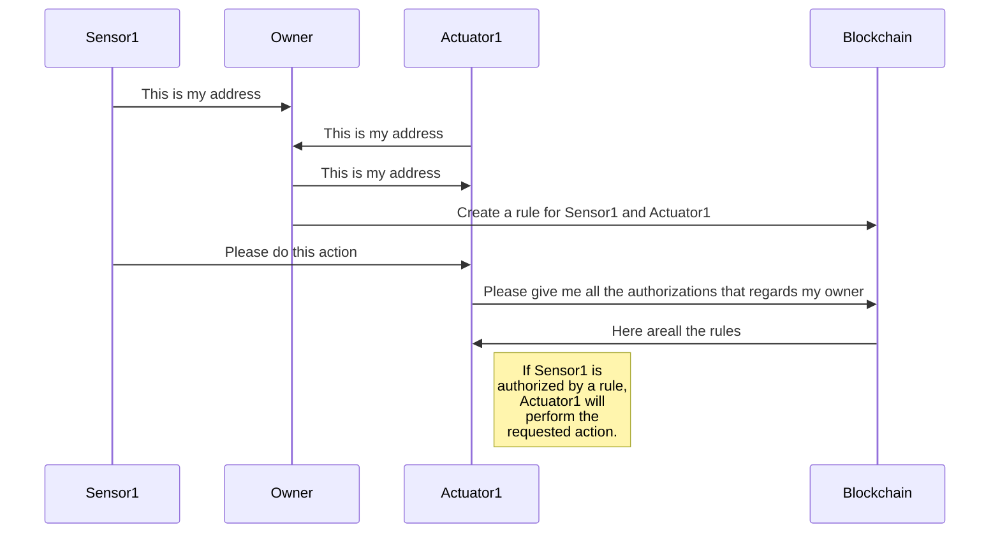

# Proof of Concept

This repository contains the Proof of Concept for project x.

# Quickstart

# Folders
This repo is divided in three folders:
## HTML
Contains the source code in HTML and Javascript which is used by the Home Owner in order to manage the autorhizations between sensors and actuators. Requires a browser which injects web3, like chrome + metamask. 
## Python
## Solidity

# Quickstart
1. Access to HTML and obtain your owner address(TODO)
2. Start an actuator, insert your owner address and take the actuator address
3. Start a sensor and take the sensor address
4. Go back to the HTML and generate a new rule
5. Wait for the blockchain confirmation
6. Insert a command in the sensor script and copy the generated packet
7. Past the packet in the actuator shell
8. If everything has been done correctly, the system will automatically work

# Authorization Process

